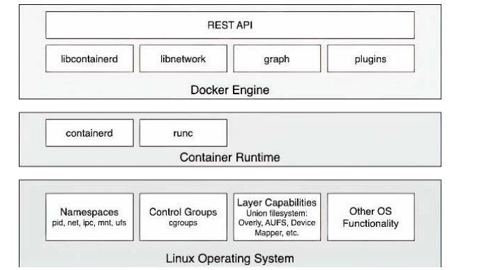
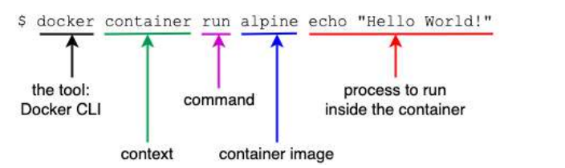
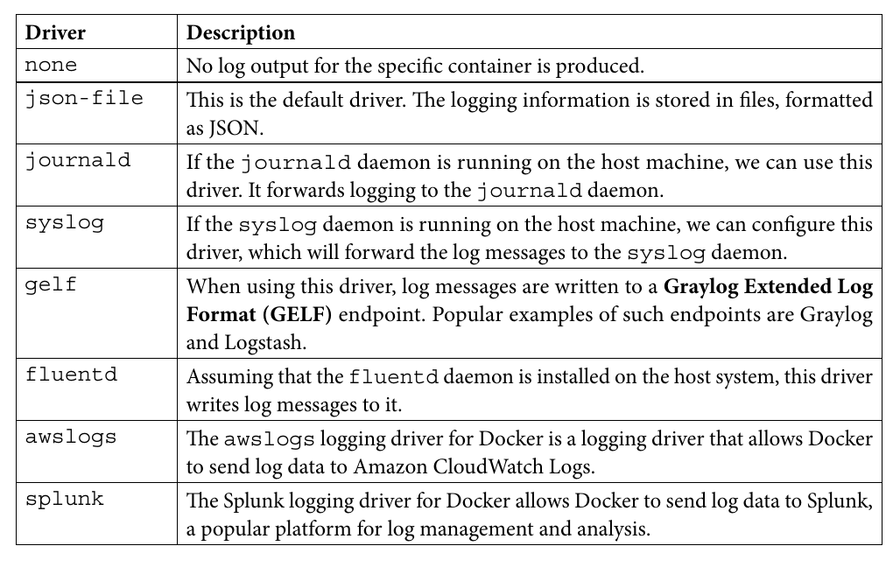
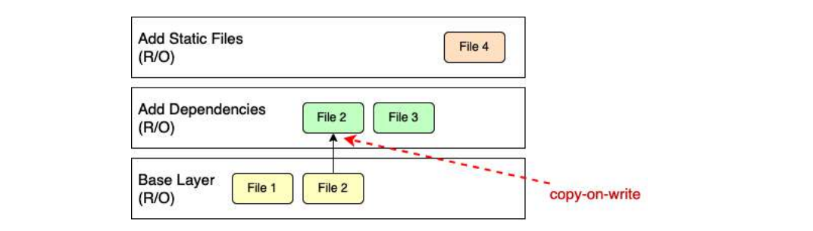
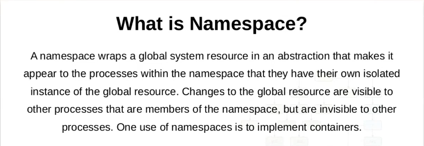
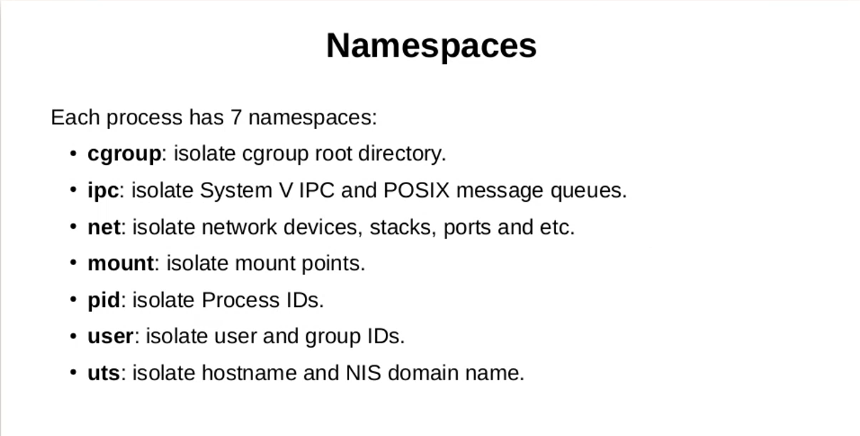
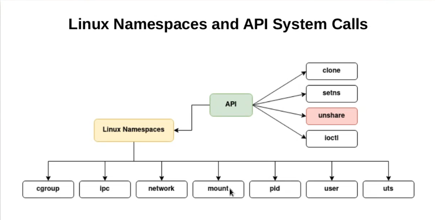
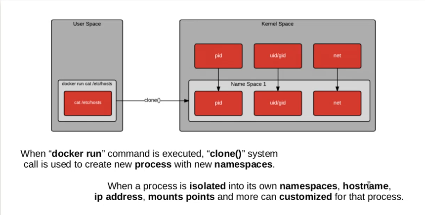

# Docker useful commands

common vulnerabilities and exposures (CVEs)

```bash
kubectl config get-contexts
kubectl expose pod nginx --type=NodePort --port=80
 kubectl config get-contexts
 kubectl port-forward nginx 8080 80
```

## command in container
```bash
docker container run centos ping -c 5 127.0.0.1
```

## IDs of all containers
```bash
docker container rm --force $(docker container ls --all --quiet)
```
## How do we get the ID of a container?
```bash
export CONTAINER_ID=$(docker container ls -a | grep trivia | awk
'{print $1}')
```
##
```bash
docker container attach nginx
docker container run --name test -it \
--log-driver none \
busybox sh -c 'for N in 1 2 3; do echo "Hello $N"; done'
```

## logs config
```bash
cd /etc/docker/daemon.json

{

    "Log-driver": "json-log",
    "log-opts": {
        "max-size": "10m",
        "max-file": 3
    }
}

```
## linux commands (kill commands)
```bash
kill -0 is used for checking process existence and permission.
kill -1 --> sudo kill -SIGHUP $(pidof dockerd)
```
## stress test
```bash
sudo apt-get install stress
stress --cpu 4 --timeout 60s
sudo apt-get install memtester
sudo memtester 1024 1
```
##
```bash
Union filesystem (unionfs) forms the backbone of what is known as container images.
```
## Copy-on-write

```bash
Copy-on-write is a strategy for
sharing and copying files for maximum efficiency. If a layer uses a file or folder that is available in
one of the low-lying layers, then it just uses it. If, on the other hand, a layer wants to modify, say, a file
from a low-lying layer, then it first copies this file up to the target layer and then modifies it
```
## Graph drivers (overlay2)
```bash
Graph drivers are also called storage drivers and
are used when dealing with layered container images. A graph driver consolidates multiple image
layers into a root filesystem for the mount namespace of the container. 
```
## we have contacted the Google home page, and with the -I
parameter, we have told curl to only output the response headers
```bash
curl -I https://google.com
```
## what has changed in our container concerning the base image
```bash
docker container diff sample
```
## to persist our modifications
and create a new image from them
```bash
docker container commit sample my-alpine
docker image history my-alipine
```
##
```bash
RUN tar -xJC /usr/src/python --strip-components=1 -f python.tar.xz
```
##
```bash
RUN apt-get update \
&& apt-get install -y --no-install-recommends \
ca-certificates \
libexpat1 \
libffi6 \
libgdbm3 \
libreadline7 \
libsqlite3-0 \
libssl1.1 \
&& rm -rf /var/lib/apt/lists/*
```
## ADD
### ADD keyword also lets us copy and
unpack TAR files, as well as provide an URI as a source for the files and folders to copy

inside the
image will have a user ID (UID) and a group ID (GID) of 0.
```bash

ADD sample.tar /app/bin/
ADD http://example.com/sample.txt /data/
ADD --chown=11:22 ./data/web* /app/data/
```
## name space

```bash
sudo ls /proc/1/ns 
cgroup	mnt  pid	       time		  user
ipc	net  pid_for_children  time_for_children  uts(hostname and NIS domain name)

```
###  ENTRYPOINT is used to define the command of the expression
### CMD is used to define the parameters for the command

```bash
ENTRYPOINT [ "ping" ]
CMD [ "-c", "3", "8.8.8.8" ]

ENTRYPOINT ["npm"]
CMD ["start"]
```
## 8 namespaces



```bash

```
## Saving and loading images
```bash
docker image save -o ./backup/my-alpine.tar my-alpine
docker image load -i ./backup/my-alpine.tar
```
 Enterprise Service Bus (ESB)
## lsns
```bash
lsns
pstree
nspawn --->s part of the systemd system and service manager suite. It is used for managing lightweight containers on Linux systems
```
##
```bash
RUN mvn --clean install
```
##
```bash
ENV baz=123
EXPOSE 5000
EXPOSE 15672/tcp
ENTRYPOINT java -jar pet-shop.war
```
## return on investment (ROI) 
```bash
• More than a 50% saving in maintenance costs
• Up to a 90% reduction in the time between the deployments of new releases
```
## docker tag
```bash
docker image tag alpine:latest gnschenker/alpine:1.0
```
##
```bash

```
##
```bash

```
##
```bash

```
##
```bash

```
##
```bash

```
##
```bash

```
##
```bash

```
##
```bash

```
##
```bash

```
##
```bash

```
##
```bash

```
##
```bash

```
##
```bash

```
##
```bash

```
##
```bash

```