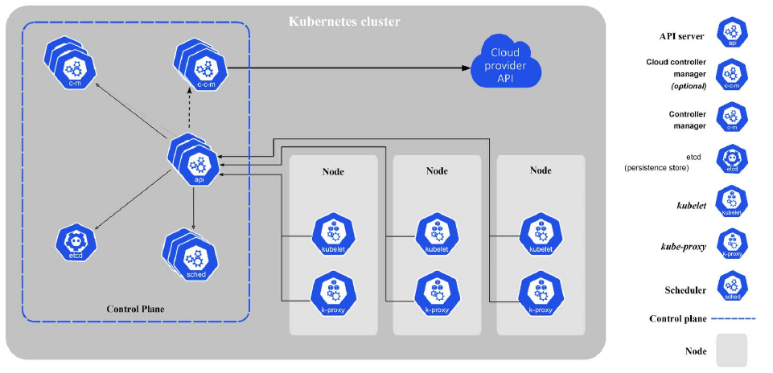

capabilities Kubernetes brings to the table:

Providing authentication and authorization
Debugging applications
Accessing and ingesting logs
Rolling updates
Using Cluster Autoscaling
Using the Horizontal Pod Autoscaler
Replicating application instances
Checking application health and readiness
Monitoring resources
Balancing loads
Naming and service discovery
Distributing secrets
Mounting storage systems

Kubernetes is not a Platform as a Service (PaaS).
other systems built on top of Kubernetes, such as OpenShift and Tanzu

services operate at layer 3 (TCP/UDP).
Kubernetes 1.2 added the Ingress object, which provides access to HTTP objects.

Services are published or discovered via one of two mechanisms: DNS, or environment variables.

The main difference between them is
that replication controllers test for membership by name equality and replica sets can use set-based
selection. Replica sets are the way to go as they are a superset of replication controllers.

StatefulSet:
StatefulSet members have the following properties:

 A stable hostname, available in DNS
 An ordinal index
 Stable storage linked to the ordinal and hostname
 Members are created and terminated gracefully in order.

Secret
Secrets are small objects that contain sensitive info such as credentials and tokens. They are stored by default as plaintext in etcd, accessible by the Kubernetes API server, and can be mounted as files into pods 

Another approach is to use secrets as environ-
ment variables. Note that secrets in a pod are always stored in memory (tmpfs in the case of mounted
secrets) for better security

Each object in k8s, Names should be up to 253 characters long and use lowercase alphanumeric characters,
dashes (-), and dots (.).you can create another object with the same name as the
deleted object, but the UIDs must be unique across the lifetime of the cluster. The UIDs are generated
by Kubernetes, so you don’t have to worry about it.

here are cluster-scope objects like node objects and persistent volumes that don’t live in
a namespace

Distributed systems design patterns:
sidecar, ambassador, and adapter

Sidecar pattern:
A great example is a central logging agent

The Istio service
mesh uses the sidecar pattern to inject its proxies into each pod. 

